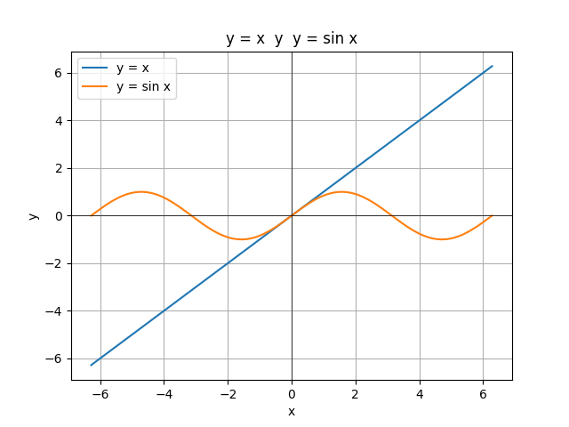
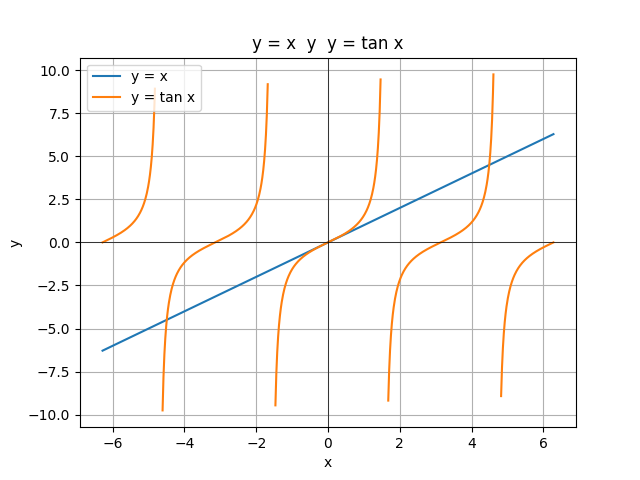
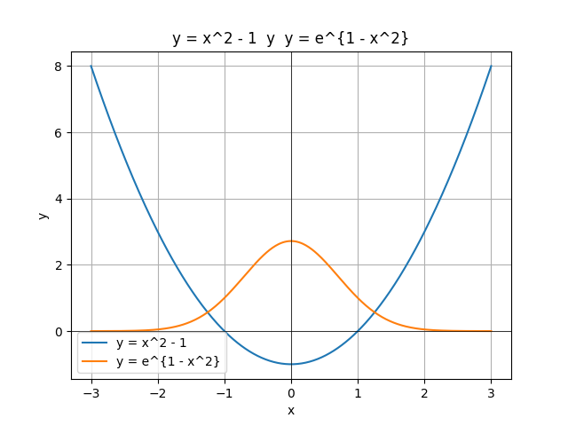

# TALLER 2
MÉTODOS NUMÉRICOS

Hecho por Lady Velasquez

Gr1CC

## Ejercicio 1
Use el método de bisección para encontrar soluciones precisas dentro de $10^{-2}$ para  
$x^3 - 7x^2 + 14x - 6 = 0$ en cada intervalo.  


```
import math

def f(x):
    return x**3 - 7*x**2 + 14*x - 6

def biseccion(f, a, b, TOL, N0):
    i = 1
    FA = f(a)
    while i <= N0:
        p = a + (b - a) / 2
        FP = f(p)
        if FP == 0 or (b - a) / 2 < TOL:
            return p, i
        i += 1
        if FA * FP > 0:
            a = p
            FA = FP
        else:
            b = p
    return None, i

TOL = 1e-2
N0 = 100
```

a. $[0, 1]$
```
raiz_a, it_a = biseccion(f, 0.0, 1.0, TOL, N0)
print(f"El resultado de la bisección en [0, 1] da la raíz {raiz_a} en {it_a} iteraciones")

```
El resultado de la biseccion da la raíz 0.5859375 en 6 iteraciones

b. $[1, 3.2] $
```
raiz_b, it_b = biseccion(f, 1.0, 3.2, TOL, N0)
print(f"El resultado de la bisección en [1, 3.2] da la raíz {raiz_b} en {it_b} iteraciones")

```
El resultado de la biseccion da la raíz 3.0023437500000005 en 7 iteraciones

c. $[3.2, 4]$
```
raiz_c, it_c = biseccion(f, 3.2, 4.0, TOL, N0)
print(f'El resultado de la biseccion da la raíz {r3} en {i} iteraciones')
print(f"El resultado de la bisección en [3.2, 4] da la raíz {raiz_c} en {it_c} iteraciones")

```
El resultado de la biseccion da la raíz 3.41875 en 6 iteraciones


## Ejercicio 2
a. Dibuje las gráficas para $y = x$ y $y = \sin x$.



b. Use el método de bisección para encontrar soluciones precisas dentro de $10^{-5}$ para el primer valor positivo de $x$ con $x = 2 \sin x$.

```
import math

def f(x):
    return x - 2 * math.sin(x)

def biseccion(f, a, b, TOL, N0):
    i = 1
    FA = f(a)
    while i <= N0:
        p = a + (b - a) / 2
        FP = f(p)
        if FP == 0 or (b - a) / 2 < TOL:
            return p
        i += 1
        if FA * FP > 0:
            a = p
            FA = FP
        else:
            b = p
    return None

raiz = biseccion(f, 1.5, 2.0, 1e-5, 100)
print(raiz)

```

## Ejercicio 3
a. Dibuje las gráficas para $y = x$ y $y = \tan x$.  



b. Use el método de bisección para encontrar una aproximación dentro de $10^{-5}$ para el primer valor positivo de $x$ con $x = \tan x$.

```
import math

def f(x):
    return x - math.tan(x)

def biseccion(f, a, b, TOL, N0):
    i = 1
    FA = f(a)
    while i <= N0:
        p = a + (b - a) / 2
        FP = f(p)
        if FP == 0 or (b - a) / 2 < TOL:
            return p
        i += 1
        if FA * FP > 0:
            a = p
            FA = FP
        else:
            b = p
    return None

raiz = biseccion(f, 4.0, 4.7, 1e-5, 100)
print(raiz)

```

# Ejercicio 4
a. Dibuje las gráficas para $y = x^2 - 1$ y $y = e^{1 - x^2}$.  



b. Use el método de bisección para encontrar una aproximación dentro de $10^{-3}$ para un valor en \([-2, 0]\) con  
$x^2 - 1 = e^{1 - x^2}$.

```
import math

def f(x):
    return x**2 - 1 - math.exp(1 - x**2)

def biseccion(f, a, b, TOL, N0):
    i = 1
    FA = f(a)
    while i <= N0:
        p = a + (b - a) / 2
        FP = f(p)
        if FP == 0 or (b - a) / 2 < TOL:
            return p
        i += 1
        if FA * FP > 0:
            a = p
            FA = FP
        else:
            b = p
    return None

raiz = biseccion(f, -2.0, 0.0, 1e-3, 100)
print(raiz)

```

## Ejercicio 5
Sea $f(x) = (x + 3)(x + 1)^2(x - 1)^3(x - 3)$.  
¿En qué cero de $f$ converge el método de bisección cuando se aplica en los siguientes intervalos?

```
import math

def f(x):
    return (x + 3) * (x + 1)**2 * (x - 1)**3 * (x - 3)

def biseccion(f, a, b, TOL, N0):
    i = 1
    FA = f(a)
    while i <= N0:
        p = a + (b - a) / 2
        FP = f(p)
        if FP == 0 or (b - a) / 2 < TOL:
            return p  # éxito
        i += 1
        if FA * FP > 0:
            a = p
            FA = FP
        else:
            b = p
    return None  # fracaso

TOL = 1e-5
N0 = 100

```

a. $[-1.5, 2.5]$
```
raiz_a = biseccion(f, -1.5, 2.5, TOL, N0)
print("a) raíz aproximada en [-1.5, 2.5]:", raiz_a)
```
Raíz aproximada en [-1.5, 2.5]: 1


b. $[-0.5, 2.4]$
```
raiz_b = biseccion(f, -0.5, 2.4, TOL, N0)
print("b) raíz aproximada en [-0.5, 2.4]:", raiz_b)
```
Raíz aproximada en [-0.5, 2.4]: 1

c. $[-0.5, 3]$  
```
raiz_c = biseccion(f, -0.5, 3.0, TOL, N0)
print("c) raíz aproximada en [-0.5, 3]:", raiz_c)
```
Raíz aproximada en [-0.5, 3]: 3

d. $[-3, -0.5]$
```
raiz_d = biseccion(f, -3.0, -0.5, TOL, N0)
print("d) raíz aproximada en [-3, -0.5]:", raiz_d)
```
Raíz aproximada en [-3, -0.5]: -3

# EJERCICIOS APLICADOS

## Ejercicio 1
Un abrevadero de longitud $L$ tiene una sección transversal en forma de semicírculo con radio $r$. (Consulte la figura adjunta.)
Cuando se llena con agua hasta una distancia $h$ a partir de la parte superior, el volumen $V$ de agua es

$$
V = L \left[ 0.5 \pi r^2 - r^2 arcsen(h/r) - h (r^2 - h^2)^{1/2} \right]
$$

Suponga que $L = 10 \text{ cm}$, $r = 1 \text{ cm}$ y $V = 12.4 \text{ cm}^3$.
Encuentre la profundidad del agua en el abrevadero dentro de $0.01 \text{ cm}$.
```

import math

L = 10.0     
r = 1.0      
V_obj = 12.4 

def f(h):
    return L * (0.5 * math.pi * r**2
                - r**2 * math.asin(h / r)
                - h * math.sqrt(r**2 - h**2)) - V_obj

def biseccion(a, b, TOL, N0):
    i = 1
    FA = f(a)
    while i <= N0:
        p = a + (b - a)/2
        FP = f(p)
        if FP == 0 or (b - a)/2 < TOL:
            return p
        i += 1
        if FA * FP > 0:
            a = p
            FA = FP
        else:
            b = p
    return None

h = biseccion(0.0, 1.0, 0.01, 100)   
print("Profundidad del agua h ≈", round(h, 2), "cm")
```
Profundidad del agua h ≈ 0.17 cm

## Ejercicio 2
Un objeto que cae verticalmente a través del aire está sujeto a una resistencia viscosa, así como a la fuerza de gravedad.
Suponga que un objeto con masa $m$ cae desde una altura $s_0$ y que la altura del objeto después de $t$ segundos es

$$
s(t) = s_0 - \frac{mg}{k} t + \frac{m^2 g}{k^2} \left( 1 - e^{-\frac{kt}{m}} \right)
$$

donde $g = 9.81 \ \text{m/s}^2$ y $k$ representa el coeficiente de la resistencia del aire en $\mathrm{N \cdot s/m}$.
Suponga $s_0 = 300 \text{ m}$, $m = 0.25 \text{ kg}$ y $k = 0.1 \ \mathrm{N \cdot s/m}$
Encuentre, dentro de $0.01$ segundos, el tiempo que tarda un cuarto de kg en golpear el piso.
```
import math

s0 = 300.0      
m = 0.25        
k = 0.1         
g = 9.81

def s(t):
    return s0 - (m*g/k)*t + (m*m*g)/(k*k) * (1 - math.exp(-k*t/m))

def f(t):
    return s(t) - 0.0   

def biseccion(f, a, b, TOL, N0):
    i = 1
    FA = f(a)
    while i <= N0:
        p = a + (b - a)/2
        FP = f(p)
        if FP == 0 or (b - a)/2 < TOL:
            return p
        i += 1
        if FA * FP > 0:
            a = p
            FA = FP
        else:
            b = p
    return None

t_impacto = biseccion(f, 0.0, 30.0, 0.01, 1000)
print("Tiempo de impacto ≈", round(t_impacto, 2), "s")
```
Tiempo de impacto ≈ 14.73 s

# EJERCICIOS TEÓRICOS

## Ejercicio 1
Use el teorema 2.1 para encontrar una cota para el número de iteraciones necesarias para lograr una aproximación con precisión de $10^{-4}$ para la solución de
$$
x^3 - x - 1 = 0
$$
que se encuentra dentro del intervalo \([1, 2]\).
Encuentre una aproximación para la raíz con este grado de precisión.

```
import math

def f(x): 
    return x**3 - x - 1

def biseccion(f, a, b, tol=1e-4, N0=100):
    i = 1
    FA = f(a)
    while i <= N0:
        p = a + (b - a)/2
        FP = f(p)
        if FP == 0 or (b - a)/2 < tol:
            return p, i
        i += 1
        if FA * FP > 0:
            a, FA = p, FP
        else:
            b = p
    return None, i

raiz, iters = biseccion(f, 1.0, 2.0, tol=1e-4, N0=100)
print("Iteraciones necesarias", 14)
print("Aproximación por bisección:", raiz)
print("Iteraciones realizadas:", iters)
```
Iteraciones necesarias: 14
Aproximación por bisección: 1.32471
Iteraciones realizadas: 14

## Ejercicio 2
La función definida por $f(x) = \sin(\pi x)$ tiene ceros en cada entero.
Muestre que cuando $-1 < a < 0$ y $2 < b < 3$, el método de bisección converge a

```
import math

def f(x):
    return math.sin(math.pi * x)

def biseccion(f, a, b, TOL, N0):
    i = 1
    FA = f(a)
    while i <= N0:
        p = a + (b - a) / 2
        FP = f(p)
        if FP == 0 or (b - a) / 2 < TOL:
            return p
        i += 1
        if FA * FP > 0:
            a = p
            FA = FP
        else:
            b = p
    return None
```
a. 0, si $a + b < 2$
```
raiz1 = biseccion(f, -0.5, 2.4, 1e-6, 100)
print("Converge a =", raiz1)
```
b. 2, si $a + b > 2$
```
raiz2 = biseccion(f, -0.5, 2.6, 1e-6, 100)
print("Converge a =", raiz2)
```
c. 1, si $a + b = 2$
```
raiz3 = biseccion(f, -0.5, 2.5, 1e-6, 100)
print("Converge a =", raiz3)
```
  
