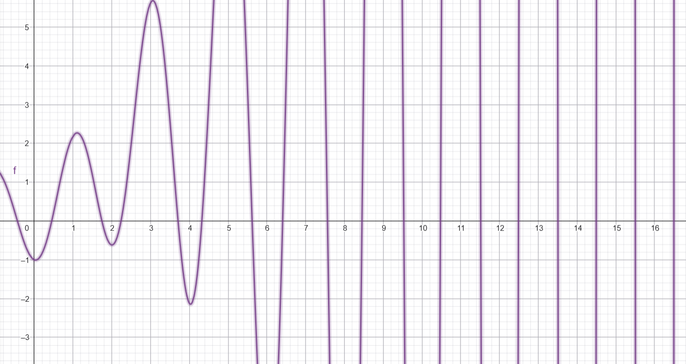

# TAREA 05 — UNIDAD 02B  
Hecho por Lady Velasquez

---

## EJERCICIO 1  
Sea \( f(x) = -x^3 - \cos(x) \) y \( p_0 = -1 \). Use el **método de Newton** y el **método de la Secante** para encontrar \( p_2 \). ¿Se podría usar \( p_0 = 0 \)?  

$$
f(x) = -x^3 - \cos(x), \quad f'(x) = -3x^2 + \sin(x)
$$

```python
from scipy.optimize import newton
import math
def fprime(x):
    return -3*x**2 + math.sin(x)

p2 = newton(func = lambda x : -x**3 - math.cos(x), x0 = -1, fprime = fprime)
print(p2)
```
**Resultado:**  
Para el método de Newton p2 = -0.8654740331016144

```python
p2 = newton(func = lambda x : -x**3 - math.cos(x), x0 = -1)
print(p2)
```
**Resultado:**  
Para el método de la Secante p2 = -0.8654740331016144

No se puede usar p_0 = 0 porque f'(0) = 0.  
Usar p_0 = 0 como punto aproximado es una mala elección, ya que en el método de newton la derivada es cero, lo que causa una división por cero indefinida. En la secante, este punto produce complicaciones por la presencia de multiplicaciones para cero.

---

## EJERCICIO 2  
Encuentre soluciones dentro de \( 10^{-4} \):  

a) \( x^3 - 2x^2 - 5 = 0 \), [1, 4]  
b) \( x^3 + 3x^2 - 1 = 0 \), [-3, -2]  
c) \( x - \cos(x) = 0 \), [0, \pi/2]  
d) \( x - 0.8 - 0.2\sin(x) = 0 \), [0, \pi/2]  

```python
from scipy.optimize import bisect

pa = newton(func = lambda x : x**3 - 2*x**2 - 5, x0 = 1, tol = 10e-4, x1 = 4)
print(pa)
pb = newton(func = lambda x : x**3 + 3*x**2 - 1, x0 = -3, tol = 10e-4, x1 = -2)
print(pb)
pc = newton(func = lambda x : x - math.cos(x), x0 = 0, tol = 10e-4, x1 = math.pi/2)
print(pc)
pd = newton(func = lambda x : x - 0.8 - 0.2*math.sin(x), x0 = 0, tol = 10e-4, x1 = math.pi/2)
print(pd)

```
**Resultados:**  
Usando el método de la Secante se obtiene:

a) 2.6906484961992585

b) -2.879385194736809

c) 0.7390834365030763

d) 0.9643338835706312


---

## EJERCICIO 3  
Use los dos métodos de esta sección para encontrar las soluciones dentro de \( 10^{-5} \):  

a) \( 3x - e^x = 0 \), \( 1 \leq x \leq 2 \)  

Método de Newton
```python
p1 = newton(func = lambda x : 3*x - math.exp(x), x0 = 1,
           fprime = lambda x : 3 - math.exp(x), tol = 10e-5, x1 = 2)
print(p1)
```
0.6190612833553127

Método de la Secante
```python
p1 = newton(func = lambda x : 3*x - math.exp(x), x0 = 1, tol = 10e-5, x1 = 2)
print(p1)
```
1.5121345517620621

b) \( 2x + 3\cos(x) - e^x = 0 \), \( 1 \leq x \leq 2 \)  

Método de Newton
```python
p1 = newton(func = lambda x : 2*x + 3*math.cos(x) - math.exp(x),
            x0 = 1,
           fprime = lambda x : 2 - 3*math.sin(x) - math.exp(x),
            tol = 10e-5, x1 = 2)
print(p1)
```
1.2397146979752596

Método de la Secante
```python
p1 = newton(func = lambda x : 2*x + 3*math.cos(x) - math.exp(x), 
            x0 = 1, tol = 10e-5, x1 = 2)
print(p1)
```
1.2397146920815107

---

## EJERCICIO 4  
El polinomio  
$$
f(x) = 230x^4 + 18x^3 + 9x^2 - 221x - 9
$$  
tiene dos ceros reales, uno en \([-1,0]\) y otro en \([0,1]\). Aproximar con \(10^{-6}\):  

a) Método de la Secante  

Para el primer intervalo [-1,0]

```python
p1 = newton(func = lambda x : 230*x**4 + 18*x**3 + 9*x**2 - 221*x - 9, 
            x0 = -1, tol = 10e-6, x1 = 0)
print(p1)
```
-0.04065928497591696

Para el segundo intervalo [0,1]
```python
p1 = newton(func = lambda x : 230*x**4 + 18*x**3 + 9*x**2 - 221*x - 9, 
            x0 = 1, tol = 10e-6)
print(p1)
```
0.9623984191155153

b) Método de Newton  

Para el primer intervalo [-1,0]

```python
p1 = newton(func = lambda x : 230*x**4 + 18*x**3 + 9*x**2 - 221*x - 9,
            x0 = -0.5,
           fprime = lambda x : 920*x**3 + 54*x**2 + 18*x -221,
            tol = 10e-6)
print(p1)
```
-0.04065928831575899

Para el segundo intervalo [0,1], mediana -0.5
```python
p1 = newton(func = lambda x : 230*x**4 + 18*x**3 + 9*x**2 - 221*x - 9, 
            x0 = 1, tol = 10e-6)
print(p1)
```
0.9623984187505414

---

## EJERCICIO 5  
Sea \( f(x) = \tan(\pi x) - 6 \).  
Raíz: \( x \approx \frac{1}{\pi}\arctan(6) \approx 0.4474 \).  
Use 10 iteraciones con:  
a) Bisección  
b) Newton  
c) Secante  

```python
from scipy.optimize import newton, bisect
import math
def f_5(x):
    return math.tan(math.pi * x) - 6
def df_5(x):
    return math.pi / (math.cos(math.pi * x)**2)

# a. Método de Bisección
res_5a = bisect(f_5, 0, 0.48, maxiter=10, full_output=True, disp=False)
print(f"a) Bisección: Raíz = {res_5a[0]}, Iteraciones = {res_5a[1].iterations}")

# b. Método de Newton
res_5b = newton(func=f_5, x0=0, fprime=df_5, maxiter=10, 
                full_output=True, disp=False)
print(f"b) Newton: Raíz = {res_5b[0]}, Iteraciones = {res_5b[1].iterations}, Convergió: {res_5b[1].converged}")
# c. Método de la Secante
res_5c = newton(func=f_5, x0=0, x1=0.48, maxiter=10, 
                full_output=True, disp=False)
print(f"c) Secante: Raíz = {res_5c[0]}, Iteraciones = {res_5c[1].iterations}, Convergió: {res_5c[1].converged}")
```
**Resultados:**  
a) Bisección: Raíz = 0.44718749999999996, Iteraciones = 10

b) Newton: Raíz = 13.655012218663435, Iteraciones = 10, Convergió: False

c) Secante: Raíz = -3694.358600967476, Iteraciones = 10, Convergió: False

En este ejercicio, el método de bisección demostró ser el más eficaz para encontrar la raíz de la función  ya que logró converger en 10 iteraciones dentro de un intervalo bien elegido donde la función cambia de signo. En contraste, los métodos de Newton y de la secante no lograron converger, debido a que la tangente presenta discontinuidades periódicas que afectan la estabilidad de estos métodos cuando se parte de puntos iniciales alejados de la raíz o cercanos a una asíntota. Por tanto, en funciones con comportamiento oscilante o discontinuo, la bisección ofrece mayor robustez y confiabilidad, mientras que Newton y la secante requieren una mejor elección inicial para ser efectivos.


---

## EJERCICIO 6  
\( f(x) = \ln(x^2 + 1) - e^{0.4x}\cos(\pi x) \)  

a) Determine el único cero negativo.

Con el método de la Secante:
```python
p1 = newton(func = lambda x : math.log(x**2 + 1) - math.exp(0.4*x)*math.cos(math.pi*x),
            x0 = -0.4, tol = 10e-6)
print(p1)
```
-0.43414304724770203

b) Los cuatro ceros positivos más pequeños. 

Con el método de la Secante:
```python
p1 = newton(func = lambda x : math.log(x**2 + 1) - math.exp(0.4*x)*math.cos(math.pi*x),
            x0 = 0.5, tol = 10e-6)
print(p1)
```
0.4506567478906115
```python
p1 = newton(func = lambda x : math.log(x**2 + 1) - math.exp(0.4*x)*math.cos(math.pi*x),
            x0 = 1.5, tol = 10e-6)
print(p1)
```
1.7447380533760186
```python
p1 = newton(func = lambda x : math.log(x**2 + 1) - math.exp(0.4*x)*math.cos(math.pi*x),
            x0 = 2.5, tol = 10e-6)
print(p1)
```
2.238319795077607
```python
p1 = newton(func = lambda x : math.log(x**2 + 1) - math.exp(0.4*x)*math.cos(math.pi*x),
            x0 = 3.5, tol = 10e-6)
print(p1)
```
3.709041201416693

c) Aproximación inicial razonable para el enésimo cero positivo. 
La gráfica de la función se ve así:

La gráfica muestra que a medida que $x$ aumenta, la amplitud de las oscilaciones crece exponencialmente. Como $\cos(\pi x)$ es cero en $x = 0.5, 1.5, 2.5, \dots$, estos valores sirven como una excelente aproximación inicial. La gráfica confirma esto: el primer cero está cerca de 0.5, el segundo cerca de 1.5 (aunque se desvía a 1.74), el tercero cerca de 2.5 (en 2.23), y así sucesivamente. Por lo tanto, una aproximación inicial razonable para el enésimo cero positivo es $p_0 = n - 0.5$.

d) Determine el vigesimoquinto cero positivo.  
Utilizando la fórmula n - 0.5 con n = 25, tal que $p_0 = 24.5$.
```python
p1 = newton(func = lambda x : math.log(x**2 + 1) - math.exp(0.4*x)*math.cos(math.pi*x),
            x0 = 24.5, tol = 10e-6)
print(p1)
```
24.49988704757148

---

## EJERCICIO 7  
\( f(x) = x^{1/3} \)  
Compare los resultados de Newton (\( x_0 = 1 \)) y Secante (\( p_0 = 5, p_1 = 0.5 \)).  

```python
from scipy.optimize import newton
import math
def f_7(x):
    if x >= 0:
        return x**(1/3)
    else:
        return -(-x)**(1/3)

def df_7(x):
    if x == 0:
        return float('inf')
    return 1 / (3 * (f_7(x)**2))

# a) Método de Newton
res_7a = newton(f_7, x0=1, fprime=df_7, maxiter=10, 
                full_output=True, disp=False)
print(f"a) Newton: Raíz = {res_7a[0]}, Iteraciones = {res_7a[1].iterations}, Convergió: {res_7a[1].converged}")

# b) Método de la Secante
res_7b = newton(f_7, x0=1, x1=0.5, maxiter=10, 
                full_output=True, disp=False)
print(f"b) Secante: Raíz = {res_7b[0]}, Iteraciones = {res_7b[1].iterations}, Convergió: {res_7b[1].converged}")
```
a) Newton: Raíz = 1023.9999999999982, Iteraciones = 10, Convergió: False

b) Secante: Raíz = -0.2323010897537782, Iteraciones = 10, Convergió: False

Ambos métodos fallan en encontrar la raíz $x=0$. El método de Newton se aleja cada vez más de la raíz. El método de la Secante también falla, pero se atasca en valores muy pequeños cerca de cero, sin lograr converger. Ambos métodos se rompen porque la gráfica de $f(x) = x^{1/3}$ se vuelve completamente vertical en la raíz $x=0$, una condición que estos métodos que dependen de la pendiente no pueden manejar.

---

